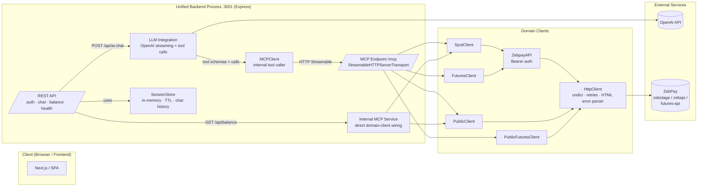
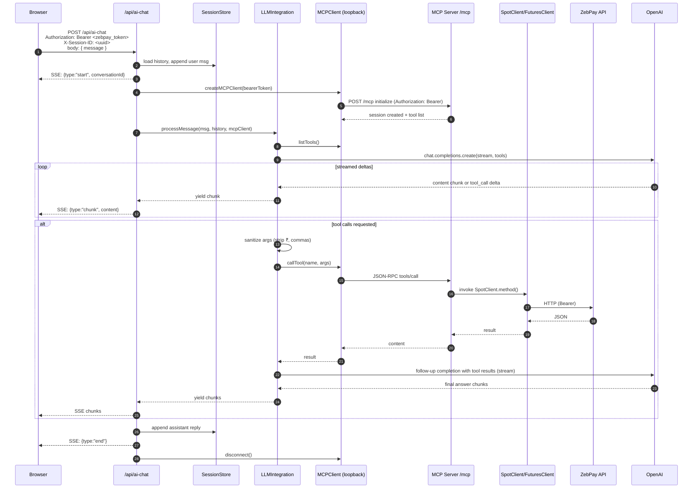
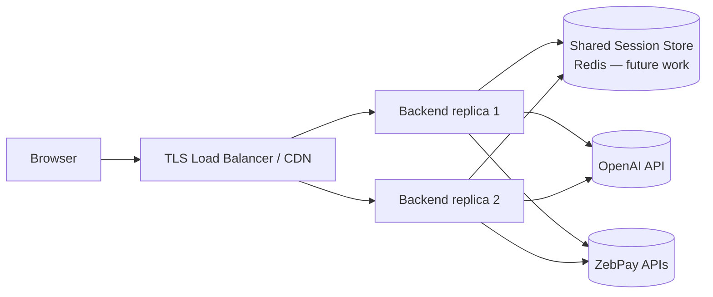

# AI Trading Chatbot — Architecture Document

> Scope: analysis of the repository root at `ai_trading_chatbot/`.
> Generated from static review of the source tree on the current branch.

---

## 1. Executive Summary

`ai_trading_chatbot` (package name `mcp-zebpay-server`, v0.1.0) is a **Node.js / TypeScript backend** that exposes the ZebPay crypto exchange's Spot and Futures APIs as an **MCP (Model Context Protocol) tool server**, and plugs that server into an **OpenAI-powered chat assistant**. The process runs everything on a **single Express port (3001 by default)** and serves three concerns side-by-side:

1. **REST API** for the frontend (`/api/auth`, `/api/ai-chat`, `/api/balance`, `/health`).
2. **MCP HTTP Streamable endpoint** at `/mcp` for LLM-driven tool calls.
3. **LLM orchestration layer** that streams GPT-4o-mini responses over Server-Sent Events and invokes MCP tools via the official `@modelcontextprotocol/sdk` client.

The end-user flow is: **browser → `/api/ai-chat` (SSE) → OpenAI (with tool schemas) → MCP client → MCP server → ZebPay REST API → streamed answer back to browser**. A short-circuit path exists for `/api/balance`, which calls the same domain clients in-process (no HTTP hop through MCP).

---

## 2. Technology Stack

| Layer | Choice | Notes |
|---|---|---|
| Runtime | Node.js 20 (Alpine image) | ES2022, NodeNext modules |
| Language | TypeScript 5.6 | `strict: true`, source maps on |
| HTTP server | Express 4 + `cors` | Single unified app (`src/backend/index.ts`) |
| HTTP client | `undici` fetch | Retries + timeouts in `src/http/httpClient.ts` |
| MCP | `@modelcontextprotocol/sdk` ^1.21 | `StreamableHTTP*` transport (server + client) |
| LLM | `openai` ^4.76 | Model configurable; defaults to `gpt-4o-mini` |
| Validation | `zod` ^3.23 | Tool input schemas |
| Auth tokens | `jsonwebtoken` (installed) | Primary auth is ZebPay Bearer token |
| Session IDs | `uuid` v4 | In-memory session store |
| Tests | `jest` + `ts-jest` ESM preset | Tests in `src/__tests__/` |
| Containerization | `Dockerfile` (Node 20 Alpine) | Exposes 3001 |

---

## 3. Repository Layout

```
ai_trading_chatbot/
├── Dockerfile                  # Production image (node:20-alpine, builds TS)
├── package.json                # Scripts: dev, build, start, start:mcp, tests
├── tsconfig.json               # rootDir=src, outDir=dist, NodeNext
├── .env                        # Runtime config (contains secrets — see §9)
├── docs/                       # This document + existing overview
├── logs/                       # Runtime logs (app.log, mcp-server.log)
├── dist/                       # Build output (tsc)
└── src/
    ├── index.ts                # Process bootstrap, starts unified backend
    ├── config.ts               # Env → typed AppConfig, redact() helper
    │
    ├── backend/                # "Frontend-facing" REST + LLM layer
    │   ├── index.ts            #   Express app assembly, CORS, routes, /health
    │   ├── api/
    │   │   ├── auth.ts         #   POST /api/auth/login|logout, GET /status
    │   │   ├── chat.ts         #   POST /api/ai-chat (SSE), history endpoints
    │   │   └── balance.ts      #   GET /api/balance (in-process fast path)
    │   ├── auth/sessions.ts    #   In-memory SessionStore (UUID, TTL, chat history)
    │   ├── llm/integration.ts  #   OpenAI tool-calling loop (streaming)
    │   └── mcp/
    │       ├── client.ts       #   Wraps @mcp/sdk Client + StreamableHTTPClientTransport
    │       └── internal.ts     #   Direct (no-HTTP) wiring of domain clients
    │
    ├── steamable_http/         # MCP HTTP server (sic: misspelled folder)
    │   └── index.ts            #   createMcpHttpApp + createMcpRouter (mounted at /mcp)
    │
    ├── mcp/                    # MCP tool / resource / prompt definitions
    │   ├── tools_spot.ts       #   ~25 spot + public market tools (2.6k LOC)
    │   ├── tools_futures.ts    #   ~21 futures tools
    │   ├── resources.ts        #   MCP resources
    │   ├── prompts.ts          #   MCP prompts
    │   ├── errors.ts           #   HttpError → McpError conversion
    │   └── logging.ts          #   MCP structured logging helpers
    │
    ├── private/                # Authenticated ZebPay domain clients
    │   ├── ZebpayAPI.ts        #   Core Bearer-auth request() wrapper
    │   ├── SpotClient.ts       #   Orders, balance, fills, exchange fees
    │   └── FuturesClient.ts    #   Positions, margin, leverage, orders
    │
    ├── public/                 # Unauthenticated market-data clients
    │   ├── PublicClient.ts     #   Spot tickers, orderbook, klines, trades
    │   └── PublicFuturesClient.ts
    │
    ├── http/httpClient.ts      # undici fetch + retries + HTML/Cloudflare parsing
    ├── security/credentials.ts # Env + InMemory credential providers (with redact())
    ├── validation/             # zod schemas and validators
    ├── utils/                  # logger, fileLogger, cache, metrics, responseFormatter
    ├── types/responses.ts      # Shared response types
    └── __tests__/              # Jest tests (errors, prompts, resources, validation)
```

---

## 4. High-Level Component View



### Key architectural properties

- **Single-port consolidation.** `src/backend/index.ts` mounts the MCP router created by `createMcpRouter()` at `/mcp` on the same Express app as the REST routes. There is no separate MCP process in the default topology — though `start:mcp` / `start:mcp:port` scripts still allow a standalone MCP server via `src/steamable_http/index.ts`.
- **Stateless-per-request MCP sessions.** Each initialize request spins up a new `McpServer` instance + domain clients carrying that request's Bearer token, stored in a session keyed by `mcp-session-id`. Session objects live in an in-process `Map`.
- **Two parallel entry paths to the same domain layer.** The LLM chat flow goes through the *external* MCP HTTP transport (loopback to `/mcp`), while `/api/balance` takes a fast in-process path via `createInternalMCPService()` — useful to avoid SSE/MCP overhead for simple REST reads.
- **Layered clients.** `HttpClient` → `ZebpayAPI` (adds auth, URL resolution, error normalization) → `SpotClient` / `FuturesClient` (domain semantics) → MCP tool registrations (tool schemas + response formatting).

---

## 5. Request Flow — AI Chat (Primary Use Case)



### Notable behaviors in the chat path

- The `Authorization: Bearer <token>` on `/api/ai-chat` is the **ZebPay bearer token** (not an app-managed JWT). It is forwarded verbatim into the MCP client's request headers so the MCP server can build per-request `InMemoryCredentialsProvider` instances.
- `X-Session-ID` is optional; without it, history is not persisted but the chat still works.
- `LLMIntegration.sanitizeToolArguments()` strips `₹ $ € £ ¥` and commas from stringified numbers before MCP tool invocation — a defensive guard against the LLM leaking formatted values into tool parameters.
- The system prompt (in `llm/integration.ts`) is extensive and pins behavior: precision rules (≤6 decimals), currency symbol rules (`₹` only for INR), and a prohibition on showing LaTeX/calculations.

---

## 6. MCP Subsystem

### Server side (`src/steamable_http/index.ts`, `src/mcp/*`)

- Two factories expose the same semantics:
  - `createMcpHttpApp(cfg)` — standalone Express app, used by `start:mcp`.
  - `createMcpRouter(cfg)` — mountable router, used by the unified backend at `/mcp`.
- For each new `mcp-session-id`, the server:
  1. Parses the Bearer token from `Authorization`, the custom `ZEBPAY_BEARER_TOKEN` header, or initialize params — falling back to `process.env.ZEBPAY_BEARER_TOKEN`.
  2. Builds `HttpClient`, `PublicClient`, `PublicFuturesClient`, and (if creds present) `ZebpayAPI`, `SpotClient`, `FuturesClient`.
  3. Creates a fresh `McpServer`, registers tools/resources/prompts, attaches a `StreamableHTTPServerTransport`, and stores everything in a `Map<sessionId, SessionData>`.
- Subsequent `POST/GET/DELETE /mcp` calls on the same session reuse the cached transport and domain clients.

### Tool catalog (~46 tools total)

| Group | Source file | Examples |
|---|---|---|
| Spot (authenticated) | `mcp/tools_spot.ts` | `zebpay_spot_placeMarketOrder`, `zebpay_spot_placeLimitOrder`, `zebpay_spot_getBalance`, `zebpay_spot_getOrders`, `zebpay_spot_getOrderById`, `zebpay_spot_cancelOrderById`, `zebpay_spot_cancelOrdersBySymbol`, `zebpay_spot_getOrderFills`, `zebpay_spot_getExchangeFee` |
| Spot public | `mcp/tools_spot.ts` | `zebpay_public_getAllTickers`, `getTicker`, `getOrderBook`, `getOrderBookTicker`, `getTrades`, `getKlines`, `getExchangeInfo`, `getCurrencies` (duplicated set appears ~line 1860+ — candidate for deduplication) |
| Futures public | `mcp/tools_futures.ts` | `zebpay_futures_public_healthCheckStatus`, `getMarkets`, `getMarketInfo`, `getOrderBook`, `getTicker24Hr`, `getAggregateTrades`, `getExchangeInfo`, `getExchangePairs` |
| Futures private | `mcp/tools_futures.ts` | `zebpay_futures_getWalletBalance`, `placeOrder`, `addMargin`, `reduceMargin`, `getOpenOrders`, `getOrderHistory`, `getLinkedOrders`, `getPositions`, `getTradeHistory`, `getTransactionHistory`, `deleteOrder`, `getUserLeverage`, `updateUserLeverage` |
| Resources & prompts | `mcp/resources.ts`, `mcp/prompts.ts` | Static resources and curated prompts exposed via MCP |

### Client side (`src/backend/mcp/client.ts`)

- Thin wrapper around `@modelcontextprotocol/sdk/client`.
- Uses `StreamableHTTPClientTransport` with `requestInit.headers.Authorization` so the Bearer travels on every JSON-RPC frame.
- 10s connect timeout, readable error mapping for `ECONNREFUSED`.
- Creates one client per `/api/ai-chat` request; disconnects in the `finally` block.

### Internal bypass (`src/backend/mcp/internal.ts`)

- `createInternalMCPService(bearerToken)` builds the same domain stack *without* going through MCP HTTP transport, and exposes typed helpers: `getBalanceInternal`, `getAllTickersInternal`, `getTickerInternal`, `placeMarketOrderInternal`, `placeLimitOrderInternal`, `cancelOrderInternal`, `getOrdersInternal`.
- Only `/api/balance` currently uses it; other REST endpoints prefer the full MCP round-trip.

---

## 7. Data Model & State

### Runtime state (all in-memory; **no database**)

| Store | Location | Keyed by | TTL |
|---|---|---|---|
| `SessionStore` | `backend/auth/sessions.ts` | UUID `sessionId` | `SESSION_TIMEOUT_MINUTES` (default 120); sweeper every 5 min |
| MCP HTTP sessions | `steamable_http/index.ts` | `mcp-session-id` (UUID from transport) | Lives until transport closes or `DELETE /mcp` |
| `tickerCache` | `utils/cache.ts` | ticker key | 5 s |
| `orderBookCache` | `utils/cache.ts` | symbol:limit | 2 s |
| `exchangeInfoCache` | `utils/cache.ts` | `exchangeInfo` | 60 s |
| `currenciesCache` | `utils/cache.ts` | `currencies` | 5 min |

`SessionData` holds: `bearerToken`, optional `exchange`, `createdAt`, `lastAccess`, and `conversationHistory: ChatMessage[]` — i.e., chat history lives alongside the credential in the same process. **Restarting the process wipes all sessions and history.**

### Key types

- `AppConfig` (`src/config.ts`): base URLs, transports, CORS origins, log level, HTTP timeout/retries.
- `ChatMessage`: `{ role: 'user'|'assistant'|'system', content, timestamp }`.
- `SpotMarketOrderParams`, `SpotLimitOrderParams`, `GetOrdersParams`, `GetExchangeFeeParams` in `SpotClient.ts`.
- Futures param shapes inlined in `FuturesClient.ts`.

---

## 8. Configuration

`src/config.ts` centralizes environment parsing with validation and a `redact()` helper.

| Variable | Default | Purpose |
|---|---|---|
| `PORT` / `BACKEND_PORT` | `3001` | Unified HTTP port |
| `HTTP_PORT` / `MCP_PORT` | `8723` | Standalone MCP server port (non-default mode) |
| `FRONTEND_URL` | — | CORS origin when `ALLOW_ALL_ORIGINS` is off |
| `ALLOW_ALL_ORIGINS` | `false` | If `true`, CORS accepts any origin |
| `SESSION_TIMEOUT_MINUTES` | `120` | SessionStore TTL |
| `OPENAI_API_KEY` | **required** | OpenAI auth |
| `OPENAI_MODEL` | `gpt-4o-mini` | Model selection |
| `MCP_SERVER_URL` | auto-set to `http://localhost:${PORT}/mcp` | Where `MCPClient` connects |
| `MCP_TRANSPORTS` | `stdio` | Standalone MCP server transport selection |
| `HTTP_CORS_ORIGINS` | `*` | CORS for standalone MCP server |
| `ZEBPAY_BEARER_TOKEN` | — | Optional server-wide fallback token |
| `ZEBPAY_SPOT_BASE_URL` | `https://www.zebstage.com/api/v2` | Authenticated spot |
| `ZEBPAY_SPOT_PUBLIC_BASE_URL` | falls back to spot base | Public spot market data |
| `ZEBPAY_FUTURES_BASE_URL` | `https://futures-api.zebstage.com/api/v1` | Futures |
| `ZEBPAY_MARKET_BASE_URL` | `https://www.zebapi.com/api/v1/market` | Alternate market endpoints |
| `ZEBPAY_ZEBAPI_BASE_URL` | `https://www.zebapi.com/api/v1` | |
| `LOG_LEVEL` | `info` | `debug`/`info`/`warn`/`error` |
| `LOG_FILE` | — | Optional file destination (rotated by `fileLogger`) |
| `HTTP_TIMEOUT_MS` | `15000` | Per-request timeout |
| `HTTP_RETRY_COUNT` | `2` | Retries for idempotent (GET) requests |

`config.ts` validates that all base URLs start with `http` and that `HTTP_PORT` is a positive integer.

---

## 9. Security Model

### What the system does right

- **Bearer tokens are never logged in plaintext.** `HttpClient.sanitizeHeaders()` redacts any header containing `key/sign/secret/password/token/authorization/auth`, and `config.redact()` masks all but the first 4 chars.
- **Per-request credential scoping.** `InMemoryCredentialsProvider` isolates each caller's token; no shared global credential.
- **Strict input validation on tools.** zod schemas in `validation/` and in-tool schemas in `tools_spot.ts`/`tools_futures.ts`.
- **MCP error conversion.** `convertHttpErrorToMcpError()` normalizes Cloudflare HTML error pages (e.g. Error 1006 IP bans) into readable JSON-RPC errors.
- **Retries limited to idempotent methods.** Only GET requests are retried on 429/5xx with backoff honoring `Retry-After`.

### Current weaknesses / risks

1. **`.env` contains a live `OPENAI_API_KEY` and is present in the working tree.** There is also no `.gitignore` entry shown for it in the repo. Rotate the key and exclude `.env` from VCS.
2. **Bearer token flows through request bodies and headers in multiple forms** (`Authorization: Bearer`, `zebpay-bearer-token`, `ZEBPAY_BEARER_TOKEN`, initialize params). More surface ⇒ more chances to mislog. An auditable single-source-of-truth path is preferable.
3. **`ALLOW_ALL_ORIGINS=true` in `.env`.** Combined with SSE and bearer auth over `Authorization` header, this is permissive; acceptable in dev but must be tightened in prod.
4. **No rate limiting, auth throttling, or per-token quota.** A leaked token could be spammed.
5. **In-memory sessions** mean no horizontal scaling without a shared store; they also mean chat history is lost on restart.
6. **`@modelcontextprotocol/sdk` tool arguments are forwarded almost directly to ZebPay.** The `sanitizeToolArguments` only strips currency symbols; business-rule validation (e.g., min notional, leverage caps) is delegated to the exchange.
7. **No CSRF protection** on REST endpoints (they rely on non-cookie Bearer auth, so CSRF is not strictly required, but worth stating explicitly).
8. **Folder name typo `steamable_http/`** (should be `streamable_http/`) — cosmetic but propagates into scripts (`start:mcp` points at `dist/steamable_http/index.js`).

---

## 10. Observability

- **`src/utils/logger.ts`** — singleton that can intercept `console.*`, tag entries with ISO timestamps + level, and tee to a file stream (`logs/app.log`).
- **`src/utils/fileLogger.ts`** — lower-level stream used by `HttpClient` to write structured `http_request` / `http_response` / `http_error` JSON lines (with sanitized headers/body and duration).
- **Log viewer scripts** referenced in `package.json` (`logs`, `logs:watch`, `logs:errors`, `logs:http`, `logs:mcp`, `logs:stats`, `logs:clear`) in a `scripts/` folder — not present in the current checkout, so those npm scripts will fail until that folder is restored.
- **Stack sanitization** in `HttpClient` strips absolute paths and collapses `node_modules/...` to the package name.
- **No metrics export** (no Prom/OTel). `utils/metrics.ts` exists but is minimal.

---

## 11. Error Handling

- **`HttpError`** thrown by `HttpClient` carries `status`, `details`, and `isHtmlResponse`.
- **`ZebpayAPI.request()`** extracts the most-specific message from common ZebPay error shapes (`statusDescription`, `error`, `message`, `msg`, `errorMessage`) and converts to `McpError` via `convertHttpErrorToMcpError`.
- **`LLMIntegration.processMessage()`** catches OpenAI errors and yields human-readable messages for 401/429/quota/billing conditions.
- **Express error middleware** in `backend/index.ts` returns 500 with `err.message` only when `NODE_ENV === 'development'`.

---

## 12. Build, Deploy, and Runtime

### Scripts (`package.json`)

- `npm run dev` — `tsx watch src/index.ts` for local dev.
- `npm run build` — `tsc -p tsconfig.json` emits to `dist/`.
- `npm start` — runs `dist/index.js` (unified backend + MCP).
- `npm run start:mcp` / `start:mcp:port` — standalone MCP HTTP server.
- `npm test` / `test:watch` — Jest with ESM preset.

### Container

```dockerfile
FROM node:20-alpine
WORKDIR /app
COPY package*.json ./
RUN npm ci
COPY . .
RUN npm run build
EXPOSE 3001
ENV NODE_ENV=production
CMD ["node", "dist/index.js"]
```

Single-process, single-port. No sidecars. No volumes for persistence (intentional — state is ephemeral).

### Recommended production topology



Horizontal scaling requires externalizing both the `SessionStore` and MCP `httpSessions` (sticky sessions are the minimum-viable workaround).

---

## 13. Testing

Jest tests in `src/__tests__/`:

- `errors.test.ts` — MCP error conversion for HTTP statuses and Cloudflare HTML.
- `validation.test.ts` — zod schema behavior.
- `resources.test.ts` — MCP resource registration.
- `prompts.test.ts` — MCP prompt registration.

No integration tests against a live/stub MCP transport and no tests for the LLM tool-calling loop.

---

## 14. Known Gaps / Recommended Next Steps

1. **Secrets hygiene** — rotate the committed OpenAI key, add `.env` to `.gitignore`, consider a secret manager.
2. **Rename `steamable_http/` → `streamable_http/`** and update script references.
3. **Deduplicate spot tools** — `tools_spot.ts` registers `zebpay_public_getAllTickers`, `getTicker`, `getOrderBook`, etc. twice; remove the second set or gate it behind a flag.
4. **Externalize session state** (Redis) to enable HA and persistence of chat history.
5. **Add integration tests** covering the SSE chat endpoint end-to-end with a mocked MCP and mocked OpenAI.
6. **Add rate limiting + per-token request caps** on `/api/ai-chat` and `/api/balance`.
7. **Introduce metrics + tracing** (OTel) — the LLM-tool-call loop is latency-sensitive and hard to debug without it.
8. **Consolidate bearer-token ingress** to a single header and validate it once per request rather than re-extracting it in three places.
9. **Tighten CORS** for non-dev environments; remove `ALLOW_ALL_ORIGINS` from the default `.env`.
10. **Restore / create the `scripts/` folder** used by `logs:*` npm scripts, or drop the scripts from `package.json`.
11. **Document the public MCP tool contract** (parameters, response shapes) — `responseFormatter.ts` is 1.1k LOC and clearly carries a lot of implicit contract.

---

## 15. Quick Reference — Public HTTP Surface

| Method | Path | Auth | Purpose |
|---|---|---|---|
| `POST` | `/api/auth/login` | body: `bearerToken` | Validate token via MCP listTools, issue `sessionId` |
| `GET`  | `/api/auth/status` | `X-Session-ID` | Session introspection |
| `POST` | `/api/auth/logout` | `X-Session-ID` | Destroy session |
| `POST` | `/api/ai-chat` | `Authorization: Bearer`, optional `X-Session-ID` | **Streaming (SSE)** chat with tool calls |
| `GET`  | `/api/ai-chat/history` | `X-Session-ID` | Fetch conversation history |
| `DELETE` | `/api/ai-chat/history` | `X-Session-ID` | Clear history |
| `GET`  | `/api/balance` | `Authorization: Bearer` | Fast in-process balance lookup |
| `GET`  | `/health` | — | Liveness |
| `POST` `GET` `DELETE` | `/mcp` | `Authorization: Bearer` or `zebpay-bearer-token` | MCP JSON-RPC over StreamableHTTP |

---

*End of document.*
