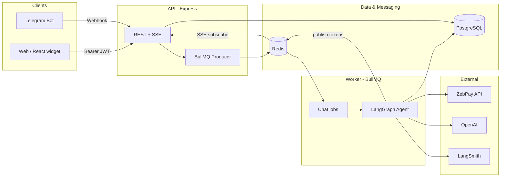

# ZebPay AI Chatbot Backend — Architecture

This document describes the **zebpay-ai** backend: a TypeScript monorepo that ships the HTTP API, background worker, shared libraries, and database migrations described below.

---

## 1. Purpose

The system provides an **AI-assisted crypto trading assistant** for ZebPay users. It:

- Accepts **authenticated chat** from web clients (Bearer token) and **Telegram** (after social linking).
- Routes work through a **queue** so the HTTP layer stays responsive; **streaming replies** use **Server-Sent Events (SSE)** bridged via **Redis pub/sub**.
- Uses a **LangGraph**-based agent with **GPT** for intent routing and **ZebPay REST APIs** (via tools) for balances, market data, portfolio, orders, and trade execution with **human-in-the-loop confirmation** for destructive actions.

---

## 2. High-Level Topology



---

## 3. Monorepo Layout

| Area | Role |
|------|------|
| **Root `package.json`** | npm workspaces: `apps/*`, `packages/*`; Turbo tasks: `build`, `dev`, `lint`, `test`, `typecheck`. |
| **`apps/api`** | HTTP API: Express, auth, chat enqueue, SSE, webhooks, linking, metrics. |
| **`apps/worker`** | BullMQ worker: pulls `chat` queue jobs and runs `runAgent()`. |
| **`packages/shared`** | Env (`zod`), DB pool, Redis clients, logger, metrics, security helpers, `getAppConfig()`, types. |
| **`packages/auth`** | ZebPay JWT verification (JWKS), user upsert, sessions, encrypted token storage. |
| **`packages/agent`** | LangGraph graph: routing, tools, pending orders, confirmation flow, Postgres checkpointer. |
| **`packages/tools`** | ZebPay API tool implementations, audit logging, `callZebpayApi`. |
| **`packages/chat-widget`** | Optional React embed (peer: React); not required for backend operation. |
| **`infra/postgres`** | SQL init and migrations (schema for users, chat, checkpoints, social linking, etc.). |

**Build:** TypeScript compiles to `dist/` per package; Turbo orchestrates dependency order (`^build`).

---

## 4. Request Flows

### 4.1 Web chat (`POST /api/chat`)

1. **Auth:** `Authorization: Bearer <ZebPay JWT>` → `authenticateBearerToken` (JWKS, expiry guard, user + session rows).
2. **Guards:** Optional prompt-injection check; **daily token budget** (Redis + DB); **SSE connection cap** and **queue depth cap** from `getAppConfig()` (DB-backed, cached).
3. **Persist** user message to `chat_messages`.
4. **Enqueue** BullMQ job `chat-message` with `userId`, `sessionId`, `threadId`, platform, `zebpayTokenRef`, IP, etc.
5. **SSE:** API subscribes to Redis channel `chat:<threadId>` and streams JSON events (`token`, `tool_call`, `confirmation_required`, `done`, `error`) to the client until `done`/`error` or disconnect.

### 4.2 Worker (`apps/worker`)

- Consumes queue `chat` with Redis prefix `REDIS_NAMESPACE`.
- Calls `runAgent(job.data)` from `@zebpay-ai/agent`.
- On **Telegram** jobs with `telegramChatId`, fetches latest assistant message from DB and calls Telegram `sendMessage` (implementation uses env for bot token path—align with deployment secrets).
- On failure, publishes an `error` event to the same Redis channel for SSE clients.

### 4.3 Order confirmation (`POST /api/chat/confirm/:confirmationId`)

- Validates pending row in `pending_orders`, updates status, enqueues `chat-confirmation` with `confirmationAction` so the agent can resume the graph with user choice.

### 4.4 Telegram webhook (`POST /webhooks/telegram`)

- Validates `X-Telegram-Bot-Api-Secret-Token`.
- `/start <session>` links external Telegram user to `social_link_sessions` / `social_accounts`.
- Otherwise, if linked and `chat` scope, enqueues chat with platform `telegram` and stable `threadId`.

---

## 5. Agent Design (`packages/agent`)

- **Framework:** LangChain **LangGraph** with **PostgresSaver** checkpointer (tables `checkpoints`, `checkpoint_writes`, etc.).
- **Routing:** OpenAI chat completion (`GPT_MODEL`) returns JSON: `action`, `args`, `assistantMessage` mapping to internal **read** tools vs **trade** tools.
- **Graph nodes (simplified):**
  - `agent` — decides action; streams assistant text via Redis when no tool or when clarifying.
  - `execute_tool` — read-only tools: account, market, portfolio, orders.
  - `confirm_order` — trade paths create `pending_orders` and emit `confirmation_required` with `confirmationId`; uses LangGraph **interrupt** for pause semantics.
  - `execute_order` — after user confirms via API, executes place/cancel against ZebPay.
  - `log_and_respond` — publishes `done`.
- **Observability:** `agentRunsTotal`, `agentRunDurationSeconds` (Prometheus).

---

## 6. Tools & ZebPay Integration (`packages/tools`)

- **`callZebpayApi`:** Builds URL from `ZEBPAY_API_BASE_URL`, attaches `Authorization: Bearer` from **decrypted stored JWT** (`getDecryptedTokenByUserId` in auth).
- **Tools:** `get_account_info`, `get_market_data`, `get_portfolio`, `get_orders`, `place_order` / `cancel_order` (preview + confirmation), `executePlacedOrder` / `executeCancelledOrder`.
- **Audit:** `writeAuditLog` + metrics per tool action; integrity fields on `audit_logs`.

---

## 7. Authentication & Sessions (`packages/auth`)

- Verifies JWT against **JWKS** (`ZEBPAY_JWKS_URI`), issuer/audience from env.
- Rejects tokens with less than `MIN_JWT_REMAINING_SECONDS` left (`TokenNearExpiryError` → HTTP 401 with `SESSION_NEAR_EXPIRY`).
- **Upserts** `users` (ZebPay subject → internal UUID); stores encrypted ZebPay token for API calls.
- **Creates** `sessions` row per authenticated request path (24h expiry in current flow).

---

## 8. Data Stores

### 8.1 PostgreSQL

Core tables include (see `infra/postgres/init.sql`):

- **Identity:** `users`, `sessions`
- **Agent:** LangGraph checkpoint tables
- **Chat:** `chat_messages`, `user_daily_usage`
- **Trading safety:** `pending_orders`, `audit_logs`
- **Social:** `social_link_sessions`, `social_accounts`, `otp_verifications`
- **Runtime config:** `app_config` (keys merged in `getAppConfig()`)

### 8.2 Redis

- **BullMQ:** queue + worker coordination (namespaced).
- **Pub/sub:** `chat:<threadId>` for SSE streaming.
- **Cache/rate limits:** daily token counters, per-IP and per-user rate limit keys, OTP rate limits, etc.

---

## 9. Cross-Cutting Concerns

| Concern | Implementation |
|---------|------------------|
| **HTTP hardening** | `helmet`, CORS allowlist (`ALLOWED_ORIGINS`), JSON body size cap, `pino-http` with auth header redaction. |
| **Rate limiting** | Redis sliding window style counters on `/api` and stricter limits on chat/confirm/link routes. |
| **Metrics** | `prom-client`: HTTP duration/count, BullMQ depth, agent metrics; `GET /metrics`. |
| **Health** | `GET /health` checks Postgres + Redis. |
| **Prompt injection** | Optional heuristic (`ENABLE_PROMPT_INJECTION_GUARD`); Telegram path may replace message with safe text. |
| **Social linking** | Feature flag via env + DB; signed link tokens (HMAC); OTP flows for device linking. |

---

## 10. Configuration

- **Environment:** Validated in `packages/shared/src/env.ts` (`zod`) — database, Redis, ZebPay JWT/API, OpenAI, LangSmith, worker concurrency, BullMQ rate limits, quotas, Telegram, secrets for linking, etc.
- **`.env` loading:** The shared package loads `.env` / `.env.local` from the repository root (resolution is relative to the compiled `env.js` module).
- **Dynamic limits:** `getAppConfig()` reads `app_config` table with ~60s cache; falls back to env on failure.

---

## 11. Deployment Notes (Conceptual)

Typical production layout:

- **Process 1:** `apps/api` (stateless HTTP + SSE long-lived connections).
- **Process 2+:** `apps/worker` (horizontally scalable; respect Redis/BullMQ and DB pool limits).
- **Dependencies:** PostgreSQL, Redis, outbound HTTPS to ZebPay, OpenAI, LangSmith, Telegram API.

Scale SSE by connection limits (`MAX_SSE_CONNECTIONS`) and queue backpressure (`CHAT_QUEUE_MAX_DEPTH`).

---

## 12. Dependency Graph (Logical)

```
api → auth, shared
worker → agent, shared
agent → tools, shared
tools → auth (token), shared
auth → shared
```

---

*Update this document when major flows or package boundaries change.*
